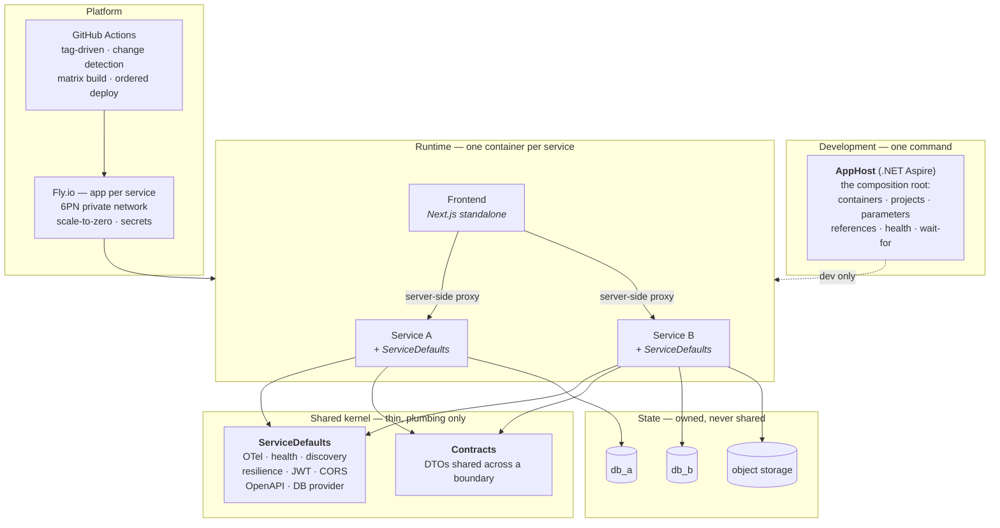

# The Reference Architecture

> The architectural blueprint extracted from **copilot-scope** and **AureliusPromptus**,
> stated as a set of rules that any new or modernized service in this estate is expected
> to follow.
>
> This is the canonical, cross-repo copy. Individual repositories are measured against
> it from their own `docs/architecture/` — for example FSE.CORE's `02-GAP-ANALYSIS.md` —
> without restating these principles; they reference this file instead.
>
> This document is descriptive first — every principle below is already implemented in at
> least one of the two reference repositories, and the file cited is the working example.
> Where the two repositories disagree, the document says which one wins and why.

---

## 0. The shape in one picture



---

## 1. Principles

### P1 — The AppHost is the composition root, and it exists for development

One Aspire `AppHost` project declares every resource the system needs — databases,
caches, backing containers, projects, frontends — plus the edges between them
(`WithReference`, `WaitFor`, `WithEnvironment`, `WithHttpHealthCheck`). A developer
clones the repository and runs one command.

> `AureliusPromptus.AppHost/AppHost.cs`; `copilot-scope/src/CopilotScope.AppHost/Program.cs`

Two rules that both repositories learned the hard way:

- **Externally-contracted ports do not float.** CopilotScope pins the collector to
  `4318` with `IsProxied = false` because five vendors' exporters are configured against
  that literal. Anything a third party configures by hand gets a fixed port.
- **The AppHost is not the production topology.** Production is described by the
  platform's own configuration (`fly.toml`, workflow env). The AppHost's `IsPublishMode`
  branch is a *manifest generator*, not a second runtime. Treating it as both is what
  produced the drift catalogued in the AureliusPromptus review §3.5.

### P2 — Shared code is a shared *kernel*, not a shared *domain*

There is exactly one shared library on the hot path, and it contains only cross-cutting
plumbing:

| Concern | Shape |
|---|---|
| Telemetry | `ConfigureOpenTelemetry` — ASP.NET Core, HttpClient, runtime instrumentation; OTLP exporter when `OTEL_EXPORTER_OTLP_ENDPOINT` is set |
| Health | `AddDefaultHealthChecks` + `MapDefaultEndpoints` → `/health` (readiness) and `/alive` (liveness, `live`-tagged only) |
| Discovery | `AddServiceDiscovery` + `ConfigureHttpClientDefaults` |
| Resilience | `AddStandardResilienceHandler` on every `HttpClient` by default |
| AuthN | `AddJwtAuthentication(configuration)` — one token contract for the estate |
| CORS | `AddCorsPolicy(configuration, policyName)` — one named policy |
| OpenAPI | `AddSwaggerWithJwt(title, version, description)` |
| Persistence | `AddDatabaseContext<TContext>(...)` — provider selection, retry policy, connection-string normalization |

> `AureliusPromptus.ServiceDefaults/` — `Extensions.cs`, `AuthenticationExtensions.cs`,
> `DatabaseProviderExtensions.cs`, `ApplicationBuilderExtensions.cs`

Everything in that list is an **extension method over `IHostApplicationBuilder`,
`IServiceCollection` or `WebApplication`**. There are no base classes, no inheritance
chains, no `ModuleBase` to derive from. A service opts in line by line:

```csharp
builder.AddServiceDefaults();
builder.Services.AddJwtAuthentication(builder.Configuration);
builder.Services.AddCorsPolicy(builder.Configuration, CorsPolicies.Frontend);
builder.Services.AddDatabaseContext<MyDbContext>(builder.Configuration, "mydb", "MyDbInMemory");
```

**What must not go in the shared kernel:** business entities, business rules, pricing
tables, user-facing strings, seed datasets, repository implementations for a specific
aggregate. Those belong to the service that owns them.

**The ceiling is mechanical, not advisory.** ~800 lines, checked in CI, plus an
architecture test asserting the kernel references no entity type. Stating the limit in
prose has already failed twice in this estate:

- FSE's `CORE` began as shared plumbing and ended as a shared *domain* — advert
  entities, points pricing, Polish category names, `CloudinaryDotNet` and `Ninject` in
  its innermost project. Every consumer was coupled to every change; version skew
  across consumers followed; the source was eventually lost while the packages stayed
  in production.
  > `FSE/docs/architecture/02-DEPENDENCY-ANALYSIS.md`
- `AureliusPromptus.ServiceDefaults` was 700 lines across six files when this document
  was written. It is now 1,365 across nine, of which 607 are `KonradPromptSeeds.cs` —
  50 seeded domain prompts — plus `SeedingConstants.cs` and a `QuotaConsumptionService`.
  The stated reason is *"single source of truth consumed by both PromptTemplatesService
  and MarketplaceService"*, which is the same reasoning that produced FSE's CORE.

**Where two services need the same domain data**, it goes in a `Contracts` project or is
owned by one service and served over HTTP. It does not go in the kernel, however
identical the two copies need to be.

The catalogue of plumbing a kernel *should* offer beyond the table above — rate
limiting, validation filters, hardened cross-service HTTP, the migration completion
signal — is in [`docs/guides/SERVICE-API-PATTERNS.md`](../guides/SERVICE-API-PATTERNS.md);
its frontend counterpart (the shared web-kit workspace package) is in
[`docs/guides/FRONTEND-BFF.md`](../guides/FRONTEND-BFF.md) §7.

**Corollary (P2a):** *every* service calls `AddServiceDefaults()`. AureliusPromptus's
AuthService does not, and it is precisely the service with no traces when its quota
endpoint misbehaves. A service that opts out of the kernel opts out of being operable.

### P3 — Service per bounded context; database per service

A service owns its schema. No second service opens a connection to it. Cross-context
reads go over HTTP against a published contract.

> AureliusPromptus: `authdb`, `prompttemplatesdb`, `agenticdb`, `marketplacedb` — four
> databases, four owners; `AgenticService` calls `PromptTemplatesService` to create a
> template rather than writing its tables.

Physical co-location is a cost decision and is allowed: on Fly.io all four databases live
in one Postgres instance created by one init script. The *logical* boundary is what must
not be crossed.

**Where the monolith is correct:** CopilotScope's Collector holds OTLP decoding, session
aggregation, scoring, the insight pipeline, persistence and the REST API in one process,
because they share a hot in-memory aggregate and splitting them would mean shipping that
aggregate over a wire on every batch. Bounded contexts are drawn around *data cohesion*,
not around nouns.

### P4 — Persistence is provider-portable and its schema is migrated, never "ensured"

The provider is a configuration switch, not a compile-time decision:

```
DATABASE_PROVIDER = PostgreSQL | SqlServer      → falls back to InMemory with no connection string
```

with provider-appropriate retry (`EnableRetryOnFailure`, 10 attempts, 30 s cap, 60 s
command timeout) and connection-string normalization for the target platform — including
Fly's `.flycast` → `.internal` rewrite and raised cold-start timeouts.

> `AureliusPromptus.ServiceDefaults/DatabaseProviderExtensions.cs`

**The one correction this blueprint makes to its own sources:** `EnsureCreated` is
permitted *only* for the InMemory/test path. Every real provider uses `MigrateAsync`
against provider-specific migrations. AureliusPromptus currently uses `EnsureCreated` on
PostgreSQL, which is why its live Fly schema is frozen at first-boot state (see that
repo's review §3.1). Do not copy that.

**Migrations run as a hosted service, after Kestrel starts**, so health probes answer
while schema work is in flight and a slow migration is not read as a failed deploy.

**Migrations describe schema; reference data is seeded separately** — by a versioned
script or a seeding service run once per environment. `HasData` in `OnModelCreating`
embeds the whole dataset in every migration snapshot: FSE seeds its category taxonomy
this way and pays for it with six Designer files of ~18,000 lines each, which means its
schema changes ship unreviewed because the diffs are unreadable.

> `AureliusPromptus.AuthService/Extensions/MigrationBackgroundService.cs`

### P5 — Configuration through the environment; secrets through the platform

One configuration model, three delivery mechanisms:

| Layer | Mechanism |
|---|---|
| Shape | Hierarchical keys — `Jwt:SecretKey`, `AzureOpenAI:Endpoint` — bound to options classes |
| Transport | Environment variables with `__` as the separator: `Jwt__SecretKey` |
| Local dev | `dotnet user-secrets` behind Aspire parameters: `builder.AddParameter("jwt-secret", secret: true)` |
| Cloud | Platform secret store — `fly secrets set`, Key Vault via Bicep, GitHub Environment secrets |

> `AureliusPromptus.AppHost/AppHost.cs` (parameters), `flyio/SECRETS.md`,
> `AureliusPromptus.AppHost/infra/*.tmpl.yaml`

No secret is ever a literal in a `csproj`, an `appsettings.json` committed to the repo, a
source comment, or an XML doc comment. Optional secrets are read with
`Configuration["Parameters:x"] ?? ""` so a missing value degrades a feature rather than
failing startup (P8).

**This is enforced by a scanner, not by review.** A secret scanner runs as a pre-commit
hook and as a CI job; a repository without one is assumed to contain credentials until
proven otherwise. Every clause of the sentence above is violated somewhere in FSE —
production SQL credentials as C# property literals *and* in committed `appsettings.json`,
a SendGrid key, an Azure Storage account key, and a Twilio SID and auth token written
into XML doc comments as documentation of each property's value.
> `FSE/docs/architecture/00-SECURITY-IMMEDIATE.md`

**Exactly one service holds a signing key.** Every other service validates tokens against
that service's published JWKS endpoint and holds no key material of its own. A symmetric
secret shared between services means verify = mint: any holder can forge a token for any
user. This is the estate's most reliably recurring mistake — AureliusPromptus distributes
one HS256 secret to six services and two frontends, and FSE arrived at the same shape
independently, with `Primates.API` shipping a `GenerateTokens` implementation it never
calls and has no business owning. Asymmetric signing makes the mistake structurally
impossible rather than merely discouraged.

Everything the identity service must get right *beyond* signing — refresh rotation,
OAuth callbacks and account linking, enumeration safety, deletion, versioned consent —
is in [`docs/guides/IDENTITY-AND-ACCOUNTS.md`](../guides/IDENTITY-AND-ACCOUNTS.md).
Where the system charges money, the billing counterpart is
[`docs/guides/PAYMENTS-AND-MONETIZATION.md`](../guides/PAYMENTS-AND-MONETIZATION.md).
The bar this principle implies for a repo's *history*, not just its current tree, before
that repo is ever made public, is in
[`docs/guides/OPEN-SOURCE-RELEASE.md`](../guides/OPEN-SOURCE-RELEASE.md).

### P6 — One container per service, built from a multi-stage Dockerfile

The contract every service container satisfies:

```dockerfile
FROM mcr.microsoft.com/dotnet/sdk:<N> AS build     # restore csproj first, then copy source
FROM mcr.microsoft.com/dotnet/aspnet:<N> AS final  # same major version as the TFM
ENV ASPNETCORE_URLS=http://+:8080
EXPOSE 8080
LABEL org.opencontainers.image.source=<repo url>
ENTRYPOINT ["dotnet", "<Service>.dll"]
```

- **Project files are copied and restored before the source**, so a code change does not
  invalidate the restore layer.
- **The runtime image major version equals the TFM major version.** Default roll-forward
  does not cross a major; CopilotScope currently violates this (review §3.1) and it is a
  startup failure, not a warning.
- **Node frontends** use the three-stage `deps → builder → runner` pattern with Next.js
  `standalone` output and a non-root `nextjs` user.
  > `AureliusPromptus.Web.Portal/Dockerfile`
- **Native dependencies are declared, not assumed** — e.g. `libfontconfig1` for QuestPDF
  in `AureliusPromptus.AgenticService/Dockerfile`.

### P7 — Fly.io is the deployment target, and the topology is cost-shaped

Per service, one Fly app, one `fly.toml`:

```toml
app = "<system>-<service>-<env>"
primary_region = "fra"

[build]
  dockerfile = "../<Service>/Dockerfile"

[env]                     # non-secret configuration only
  ASPNETCORE_URLS = "http://+:8080"
  DATABASE_PROVIDER = "PostgreSQL"

[http_service]
  internal_port = 8080
  force_https = true
  auto_stop_machines = "stop"
  auto_start_machines = true
  min_machines_running = 0      # 1 for anything on a synchronous request path

[[http_service.checks]]
  path = "/health"
  grace_period = "60s"          # covers .NET cold start + schema init

[[vm]]
  size = "shared-cpu-1x"
  memory = "512mb"
```

> `AureliusPromptus/flyio/*.fly.toml`

Rules that carry:

- **Stateful services get no public listener.** Postgres has no `[http_service]` and no
  `[[services]]` block at all; it is reached only over Fly's private 6PN network at
  `<app>.internal:5432`. No public port, no proxy smoke checks.
  > `flyio/postgres.fly.toml`
- **Scale to zero by default, except on a synchronous path.** `min_machines_running = 0`
  is the default; a service another service calls in-request needs `1`, or the caller's
  timeout must cover a cold boot (AureliusPromptus review §3.4). The diagnostic is
  mechanical: for every in-request call A→B, either B pins a machine or A's timeout
  exceeds B's cold start — and in practice the second option is written down far more
  often than it is actually configured, so prefer the first.
- **Volumes are declared with an initial size and a `PGDATA` subdirectory**, because
  initdb requires an empty data directory and the volume root carries `lost+found`.
- **Cost is reasoned about explicitly**, per service, in the repository.
  > `flyio/INFRASTRUCTURE-ANALYSIS.md`

The operational detail this principle implies — what a service must satisfy to be
deployable at all, every `fly.toml` field annotated, the four app shapes, private
networking, volumes, and the failure modes each rule exists to prevent — is in
[`docs/guides/FLY-IO-DEPLOYMENT.md`](../guides/FLY-IO-DEPLOYMENT.md). A fifth,
customer-hosted shape — the vendor pushes images, the customer runs everything — is in
[`docs/guides/PRIVATE-CLOUD-DELIVERY.md`](../guides/PRIVATE-CLOUD-DELIVERY.md).

### P8 — Optional dependencies degrade; they do not fail startup

Every external integration is registered conditionally on its configuration being
present, with a working fallback:

| Integration | Present | Absent |
|---|---|---|
| SendGrid | `SendGridEmailService` | `NoOpEmailService` that logs |
| Google / GitHub OAuth | provider registered | provider absent, password login still works |
| Azure AI Foundry | `HybridPromptGenerationService` routing per operation | direct Azure OpenAI |
| Blob storage | real ZIP from the container | stub ZIP |
| Postgres (CopilotScope) | `PersistenceWriter` + rehydrate | in-memory only |
| Judge / AgentForge | cloud analyzers register | analyzers report `no-data`, not an error |

> `AureliusPromptus.AuthService/Program.cs`;
> `AureliusPromptus.AgenticService/Infrastructure/ServiceCollectionExtensions.cs`;
> `copilot-scope/src/CopilotScope.Collector/Program.cs`

How the Azure AI Foundry side of that table gets provisioned in the first place — the
Hub/Project/Connection Bicep, per-service managed identity and RBAC, and the
agent-as-code job that turns a JSON file into a running agent — is in
[`docs/guides/AZURE-AI-FOUNDRY-AGENTS.md`](../guides/AZURE-AI-FOUNDRY-AGENTS.md). That
guide is orthogonal to P7: the agents it describes can back a service running on Fly.io
or on Azure Container Apps.

The test: `git clone && dotnet run` with zero cloud credentials must produce a working
system with reduced features.

### P9 — Program.cs is a manifest; wiring lives in extension methods

`Program.cs` reads as a list of capabilities, not as configuration code. Each block is one
call into a `ServiceCollectionExtensions` in the owning service.

> `AureliusPromptus.AgenticService/Program.cs` — 130 lines for a service with four
> orchestrators, a flow engine, a step pipeline, two AI backends, rate limiting and a job
> mode. `AureliusPromptus.AuthService/Program.cs` — 399 lines doing the same job inline,
> and it is the harder file to change.

Within a service, the layering is:

```
Controllers / minimal-API endpoints    → transport only: bind, authorize, delegate
  Orchestrators                        → use-case coordination across services
    Pipeline steps / domain services   → one responsibility each, chainable
      Repositories / DbContext         → data access
```

> `AureliusPromptus.AgenticService/Services/Orchestration/` — orchestrators plus a
> chain-of-responsibility step pipeline (`ConversationValidationStep` →
> `LanguageDetectionStep` → `PromptExtractionStep`).

### P10 — Extensibility through interface + registration, not inheritance

A new algorithm, provider or step is a class implementing an interface and one DI line.
No base class to derive from, no framework to satisfy.

> `copilot-scope/src/CopilotScope.Collector/Quality/Insights.cs` — `IInsightAnalyzer`;
> five implementations registered in `Program.cs`, consumed via `InsightPipeline`. Cloud-only
> analyzers implement the same interface and register conditionally.

This is the pattern that replaces the "core library base class" idea entirely. A `.Core`
library in this estate exports *interfaces and extension methods*; it does not export
things you inherit from.

### P11 — Anti-corruption at the edge

External dialects are normalized into one internal model at the boundary, once. Nothing
downstream knows there was more than one dialect.

> `copilot-scope/src/CopilotScope.Collector/Domain/Sem.cs` and `Domain/ClaudeCode.cs` map
> `gen_ai.*`, `github.copilot.*` and `claude_code.*` onto a single session model. Adding a
> fifth assistant cost a mapping file.

The same rule applies to payment providers, mail providers, SMS providers and map
providers: one internal abstraction, one adapter per vendor, no vendor type crossing the
boundary.

### P12 — Tag-driven CI/CD with change detection and ordered deploy

```
push tag v*
  ├── detect-changed-services      (path filters → matrix)
  ├── build                        (matrix, GHA layer cache, push to registry)
  └── deploy in dependency order   (data → auth → domain services → jobs → frontends)
```

> `AureliusPromptus/.github/workflows/flyio.yml` — the job graph is documented as ASCII
> art in the file header; `copilot-scope/.github/workflows/build-containers.yml` — matrix
> with `fail-fast: false` so one broken image does not cancel the others mid-push.

Additional rules both repositories arrived at:

- **PR environments** are provisioned and destroyed by workflow
  (`flyio-pr-env-deploy.yml` / `-destroy.yml`) — the full pattern, including the
  shared-vs-per-PR classification and teardown discipline, is in
  [`docs/guides/PR-PREVIEW-ENVIRONMENTS.md`](../guides/PR-PREVIEW-ENVIRONMENTS.md).
- **One-shot jobs run as ephemeral machines** that run and exit — Fly `machine run`, not a
  long-lived app. AureliusPromptus's agent provisioner is the worked example, including
  flushing stdout and sleeping before exit so the log forwarder captures output.
- **Build once, deploy many.** Where a repository targets two platforms, the same image
  digest should reach both. AureliusPromptus builds twice and documents the cost of it;
  do not repeat that.
- **A service whose Fly app does not exist is always selected**, whatever the diff says.
  This is the rule that lets a cold estate come up from a single tag with no manual
  `fly launch`, and it is the one most often missing.
- **Deploy gates accept `success || skipped` from upstream jobs.** Without it, change
  detection and ordering fight each other and any unchanged service in the middle of the
  chain blocks everything behind it.

The workflow in full — change detection against the previous tag, the build matrix,
per-job gating, bootstrapping, and the scale/destroy companions — is in
[`docs/guides/FLY-IO-DEPLOYMENT.md`](../guides/FLY-IO-DEPLOYMENT.md) §10–§12.

### P13 — Test at the layer that has the logic

| Layer | Tooling | What it covers |
|---|---|---|
| Unit | xUnit, one project per service | Parsers, scoring, prompt builders, validators, orchestrator flow |
| Integration | xUnit + InMemory or a real container | Persistence round-trips, migration application |
| E2E | Playwright | Cross-app user journeys |

> `copilot-scope/tests/CopilotScope.Tests/` — 16 files against decoders, quality engine,
> judge parsing, persona provisioning, persistence round-trip.
> `AureliusPromptus/tests/` — five service test projects plus `playwright.config.ts`.

The InMemory fallback in `AddDatabaseContext` exists partly so tests need no container.

The strategy above this principle — what each tier is for, when each runs, the per-test
quality bar, and what only a human can test — is in
[`docs/guides/TESTING-STRATEGY.md`](../guides/TESTING-STRATEGY.md).

**A green E2E run is only evidence if the suite is verified and wired to CI — neither is
optional.** A 2026-08-14 audit of `AureliusPromptus.AcceptanceTests` (447 Playwright
tests) found roughly 45% were placeholders or guarded-away from ever asserting anything,
the suite had never been wired into CI in either repo, and it duplicated itself across a
retired frontend and its replacement with no record of which was current. None of this
was visible from the test count or the folder structure — only from reading the test
bodies. The operational rules this produced — the assertion discipline that makes a
passing test mean something, the locator and waiting conventions, and why CI wiring is
part of a suite's definition of done, not a follow-up — are in
[`docs/guides/E2E-ACCEPTANCE-TESTING.md`](../guides/E2E-ACCEPTANCE-TESTING.md).

### P14 — Documentation lives in the repository and records reasoning, not just steps

Both repositories keep decision records next to the code, and both are better for it:

- `copilot-scope/docs/STRATEGY.md` — why the project exists, what already exists, what it
  deliberately will not do. Written when the repo had no users.
- `copilot-scope/README.md` §"How *not* to use CopilotScope" — the anti-goals stated before
  the features.
- `AureliusPromptus/flyio/INFRASTRUCTURE-ANALYSIS.md` — argues *against* a change (GHCR)
  on switching-cost grounds, with numbers.
- `AureliusPromptus/docs/diagrams/*.puml` — nine PlantUML diagrams kept current.

A document that says "we considered X and rejected it because Y" is worth more than a
document that lists commands.

**Corollary: a stale README is a review finding.** Documentation that describes a
system that no longer exists is worse than none. The hygiene that keeps a repository's
claims true — and everything else a repo carries before its first feature — is in
[`docs/guides/REPO-BASELINE.md`](../guides/REPO-BASELINE.md); the review method that
audits it is in [`docs/guides/SECURITY-REVIEW.md`](../guides/SECURITY-REVIEW.md); the
additional bar a repo clears once, before its first public release, is in
[`docs/guides/OPEN-SOURCE-RELEASE.md`](../guides/OPEN-SOURCE-RELEASE.md).

### P15 — Observability is a build-time decision, not an afterthought

OTLP first: traces, metrics and logs exported to whatever endpoint
`OTEL_EXPORTER_OTLP_ENDPOINT` names, with Azure Monitor added when
`APPLICATIONINSIGHTS_CONNECTION_STRING` is present. Health-check requests are filtered out
of traces so probe noise does not dominate.

> `AureliusPromptus.ServiceDefaults/Extensions.cs`

**Corollary:** CopilotScope — an observability product — currently emits no telemetry
about itself and has no ServiceDefaults at all (review §3.5). The blueprint takes
AureliusPromptus's side here without qualification.

---

## 2. Where the two repositories disagree, and who wins

| Question | copilot-scope | AureliusPromptus | Blueprint |
|---|---|---|---|
| Shared kernel | none | `ServiceDefaults` | **AureliusPromptus** — P2 |
| Self-instrumentation | none | OTel everywhere but AuthService | **AureliusPromptus** — P15 |
| Cloud target | Azure Container Apps (partial Bicep) | Fly.io primary, ACA in parallel | **Fly.io** — P7 |
| Registry | GHCR, public images | `registry.fly.io`, private | **GHCR** — P12, portable and free at this scale |
| Schema management | not applicable (jsonb snapshot) | `MigrateAsync` on SQL Server, `EnsureCreated` on Postgres | **`MigrateAsync` always** — P4 |
| API auth | one shared ingest key, read API open | JWT everywhere | **JWT / OIDC** — P5 |
| Token signing | n/a | HS256 shared secret | **Asymmetric + JWKS** — P5; required, not aspirational. FSE implements it first (ADR-007) |
| Endpoint style | minimal API | MVC controllers | either, per service; keep transport thin — P9 |
| Program.cs size | ~280 lines (Collector, justified — it *is* the API) | 130 (Agentic) vs 399 (Auth) | **Agentic's shape** — P9 |
| Docs language | mixed EN/PL | mixed EN/PL | **English for anything needed to build or deploy** |

---

## 3. Compliance checklist

Any service claiming to follow this blueprint answers yes to all of these:

- [ ] Declared in the AppHost with `WithReference`, `WaitFor` and `WithHttpHealthCheck`
- [ ] Calls `AddServiceDefaults()` and `MapDefaultEndpoints()`
- [ ] Exposes `/health` and `/alive`; the platform health check points at `/health`
- [ ] Emits OTLP traces, metrics and logs
- [ ] Owns its database; no other service connects to it
- [ ] Schema applied by `MigrateAsync` from provider-specific migrations, in a hosted service
- [ ] All configuration from environment variables; no secret in source, config file, or comment, with a secret scanner in CI
- [ ] Exactly one service holds a signing key; all others validate against its JWKS endpoint
- [ ] The shared kernel holds no entity, DTO, enum, seed dataset, pricing constant or user-facing string — asserted by an architecture test and a CI size check
- [ ] Every optional integration has a working no-op or fallback
- [ ] Multi-stage Dockerfile; runtime image major version equals the TFM major version; listens on `:8080`; non-root where the base image allows
- [ ] One `fly.toml`; `min_machines_running = 1` if another service calls it in-request
- [ ] Outbound `HttpClient`s carry the standard resilience handler with explicit timeouts
- [ ] `Program.cs` is a manifest; wiring is in `ServiceCollectionExtensions`
- [ ] Extension points are interfaces registered in DI, not base classes
- [ ] Has a test project; the logic-bearing layer is covered. When behaviour is being *migrated*, its characterisation tests are written before the move, not after
- [ ] Built by the tag-driven workflow with path-based change detection
- [ ] Its architectural decisions are recorded in `docs/`

---

## 3a. Known open deviations

A principle whose named violation stays open indefinitely reads as optional. These are
the deviations this document calls out that are **still unfixed**, as of 2026-08-14.

| Repo | Deviation | Principle | Since |
|---|---|---|---|
| copilot-scope | All 8 projects target `net8.0`; both Dockerfiles are `sdk:10.0` / `aspnet:10.0`. Roll-forward does not cross a major, so these images fail at startup. | P6 | flagged in its ARCHITECTURE_REVIEW; survived a Dependabot bump |
| copilot-scope | No ServiceDefaults, no self-instrumentation — in an observability product | P2, P15 | as reviewed |
| AureliusPromptus | `EnsureCreated` on PostgreSQL; live Fly schema frozen at first-boot state while migrations accumulate in code | P4 | as reviewed |
| AureliusPromptus | `ServiceDefaults` carries 607 lines of seeded domain prompts plus a `QuotaConsumptionService` — 1,365 lines total against a stated ~700 ceiling | P2 | grew after the review |
| AureliusPromptus | One HS256 secret distributed to six services and two frontends | P5 | as reviewed |
| AureliusPromptus | `AuthService` does not call `AddServiceDefaults()` | P2a | as reviewed |
| AureliusPromptus | Live credentials committed in a tracked helper script (`scripts/test-provision-agents.ps1`); no secret scanner in pre-commit or CI. Rotate first, then clean history | P5 | found 2026-08-14 |
| AureliusPromptus | Rate-limiting policy copy-pasted into four services; the kernel has no `AddStandardRateLimiting()` | P2 | found 2026-08-14 |
| AureliusPromptus | Committed Playwright config references a renamed app directory and a nonexistent test dir; no CI context executes E2E | P13 | found 2026-08-14 |
| AureliusPromptus | E2E suite (447 tests, separate `AcceptanceTests` repo) never wired to CI; ~45% of tests are placeholders or guard-then-bail with no reachable assertion; duplicated across a retired frontend (`Web.NextJs`) and its live replacement (`Portal`) with no record of which was current | P13 | found in the 2026-08-14 audit that produced `docs/guides/E2E-ACCEPTANCE-TESTING.md`; remediation plan lives in the AcceptanceTests repo's own `E2E_Tests_analysis.md` |
| `konradcinkusz/authservice` | Refresh tokens stored in plaintext (`RefreshToken.Token`, compared directly, never hashed) — carried forward unmodified from `AureliusPromptus.AuthService`, which `IDENTITY-AND-ACCOUNTS.md` §2 already names as the negative worked example ("do not copy that"). The guide's warning did not reach the extraction that happened the same day it was written. | P5 (adjacent — treat a refresh-token table like a credentials table); `IDENTITY-AND-ACCOUNTS.md` §2 | found 2026-08-14, in the extraction itself |
| `konradcinkusz/FSE.Club` | One symmetric HS256 secret validates tokens across its `fseclub-authservice` instance and both of its own API services — `authservice`'s current signing mechanism has no asymmetric/JWKS option yet. Logged as a deliberate, revisit-if-authservice-changes decision in FSE.Club's own `rewrite/docs/architecture/05-DECISIONS.md`, not an oversight — recorded here too because an acknowledged deviation belongs in both places. | P5 | adopted 2026-08-14 |

When one is fixed, delete the row. When a new one is accepted deliberately, add it with
the reasoning — an acknowledged deviation is a decision; an unacknowledged one is drift.

## 4. Deliberate non-goals of this blueprint

Stated so that scope creep has something to fail against:

- **No service mesh, no sidecars.** Fly's 6PN private network plus per-service JWT is the
  whole network security model. Both reference systems run fewer than a dozen services.
- **No shared database and no shared ORM entities across services.** A shared DTO contract
  is permitted; a shared `DbContext` is not.
- **No event bus until there is a use case that needs one.** All current cross-service
  communication is synchronous HTTP against a published contract, and both systems are
  small enough that this is honest rather than naive. Introducing a broker is an explicit,
  recorded decision, not a default.
- **No custom DI container.** `Microsoft.Extensions.DependencyInjection` only. This
  matters most for FSE, which is built on Ninject — see
  `FSE/docs/architecture/03-GAP-ANALYSIS.md` G-3. The asymmetry is the argument: the
  removal cost is small (Ninject touches 7 files there, and each `Bind<I>().To<C>()`
  maps one-to-one onto `services.AddTransient<I, C>()`), while the blocking cost is
  total — every capability in this blueprint is an extension method over
  `IServiceCollection`, and none of them are reachable from inside a Ninject module.
- **No abstraction over the platform.** `fly.toml` is written directly. A hand-rolled
  deployment abstraction over Fly, ACA and Kubernetes costs more than it saves at this
  size.

---

## Provenance

This document was originally authored inside `FSE.CORE/docs/architecture/` (now the
`FSE` monorepo) while that repo was itself being modernized against it — a workable but logically awkward home for
a constitution meant to govern the whole estate. It now lives here, in
`architecture-standards`, a neutral repo with no modernization work of its own, so every
other repo's review or modernization session can point at one stable path instead of a
moving target.

**Amendment history.**

- *2026-08-10* — amendments driven by the FSE monorepo analysis
  (`FSE/docs/architecture/07-STANDARDS-FEEDBACK.md`): P2's kernel ceiling made
  mechanical after a second occurrence of domain-in-kernel drift; P4 given a rule on
  seed data; P5 extended with scanner enforcement and promoted asymmetric signing from
  aspiration to requirement; P7 given the cold-start diagnostic; three checklist items
  added; §3a "Known open deviations" introduced; RECOVER mode added to the playbook.
- *2026-08-12* — P8 cross-referenced to the new
  [`docs/guides/AZURE-AI-FOUNDRY-AGENTS.md`](../guides/AZURE-AI-FOUNDRY-AGENTS.md) guide,
  covering how the Azure AI Foundry integration it lists as an optional dependency is
  actually provisioned (Bicep Hub/Project/Connection, per-service RBAC, agent-as-code).
- *2026-08-14* — P13 cross-referenced to the new
  [`docs/guides/E2E-ACCEPTANCE-TESTING.md`](../guides/E2E-ACCEPTANCE-TESTING.md) guide,
  extracted from a full audit of AureliusPromptus's 447-test E2E suite; §3a gained a row
  for the suite's CI-wiring and assertion-discipline gaps found by that audit.
- *2026-08-14* — eleven operational guides added, extracted from a full sweep of
  AureliusPromptus (docs, code, infra/CI) for generic knowledge the standards lacked:
  `PAYMENTS-AND-MONETIZATION`, `IDENTITY-AND-ACCOUNTS`, `SERVICE-API-PATTERNS`,
  `FRONTEND-BFF`, `BROWSER-EXTENSIONS`, `TESTING-STRATEGY`, `SECURITY-REVIEW`,
  `REPO-BASELINE`, `PR-PREVIEW-ENVIRONMENTS`, `PRIVATE-CLOUD-DELIVERY`,
  `AZURE-OPERATIONS`. Cross-references added from P2, P5, P7, P12, P13 and P14; P14
  given the stale-README corollary; three deviations recorded in §3a (committed
  credentials, copy-pasted rate limiting, rotted E2E config).
- *2026-08-14* — [`docs/guides/AZURE-AI-FOUNDRY-AGENTS.md`](../guides/AZURE-AI-FOUNDRY-AGENTS.md)
  re-verified line by line against AureliusPromptus and corrected where it had drifted.
  The Bicep and RBAC sections held exactly; four things had not. Agent provisioning is a
  run-and-exit job (`RunAsJob`) on an ephemeral machine, not the startup `IHostedService`
  the guide taught — that path is now the implementation's own development-only fallback.
  Superseded agents are deleted and orphans swept, reversing the guide's "never delete
  old versions" rule, which had been stranding an agent per version bump; the in-flight
  conversation cost that rule was protecting is now stated as an accepted consequence
  with a per-request agent-resolution mitigation. CI provisions with `az deployment sub
  create`, not `azd`, which survives only for local and greenfield use. The tracking
  table is scoped by logical agent environment, deliberately separate from
  `ASPNETCORE_ENVIRONMENT`. §11 and §12 updated to match.
- *2026-08-14* — `konradcinkusz/authservice` (an extraction of `AureliusPromptus.AuthService`)
  was adopted by `konradcinkusz/FSE.Club` as an identity provider — the estate's first
  case of one system running its own independent instance of another system's extracted
  service. New guide [`docs/guides/OPEN-SOURCE-RELEASE.md`](../guides/OPEN-SOURCE-RELEASE.md)
  added and cross-referenced from P5 and P14, covering the history-audit and release
  checklist neither principle stated on its own. A Postgres image gotcha (Fly's managed
  `postgres-flex` failing against a plain `flyctl deploy`) added to
  `FLY-IO-DEPLOYMENT.md`'s failure-mode table. §3a gained two rows: `authservice`
  carrying forward the exact plaintext-refresh-token flaw `IDENTITY-AND-ACCOUNTS.md`
  already warns against, and FSE.Club's symmetric signing key as a logged, deliberate
  P5 deviation. The general pattern this raises — a service built for reuse *across*
  systems, not just within one — is proposed but not yet merged, in
  `docs/proposals/EXTRACT-SHARED-SERVICE-PATTERN.md`.
