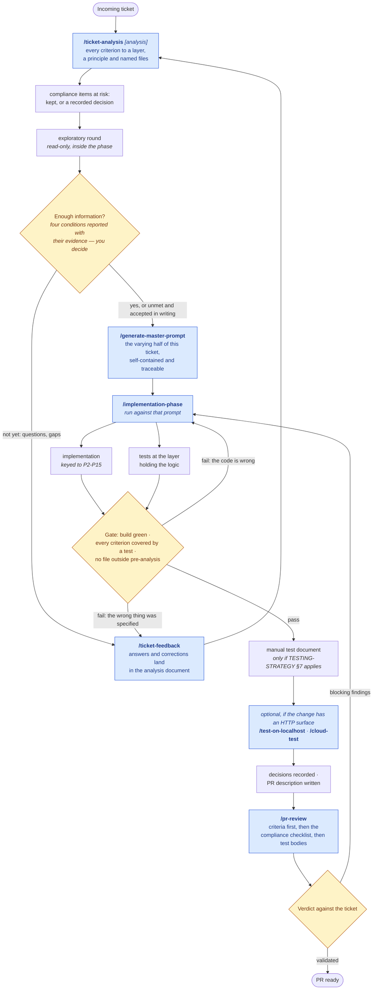

# Running a ticket

How the delivery phases fit together, and how to use them. The phases themselves are
[`TICKET-ANALYSIS.md`](TICKET-ANALYSIS.md),
[`GENERATE-MASTER-PROMPT.md`](GENERATE-MASTER-PROMPT.md),
[`IMPLEMENTATION-PHASE.md`](IMPLEMENTATION-PHASE.md) and [`PR-REVIEW.md`](PR-REVIEW.md),
with [`FEEDBACK.md`](FEEDBACK.md) closing every loop between them; this document is the map
above them.

They exist because the procedure for delivering a ticket is the same every time. That is
what made it worth writing down, and what makes it worth installing rather than pasting:
a prompt rewritten per ticket is a prompt that drifts per ticket.

**Contents**

1. [The flow](#1-the-flow)
2. [What changed, and what it cost](#2-what-changed)
3. [Install](#3-install)
4. [Running a ticket](#4-running-a-ticket)
5. [Breaking the sequence](#5-breaking-the-sequence)
6. [Under a client without slash commands](#6-under-a-client-without-slash-commands)

---

## 1. The flow

Boxes naming a `/command` are skills you invoke. Diamonds are gates, and each one has
written exit criteria in the phase document that precedes it — that is the whole point of
them being drawn as gates rather than as good intentions. The first one is **yours to
open**: the phase reports its four conditions with the evidence for each and recommends,
and you decide. What it does not let you do is open it silently (§2).

Every phase opens by confirming the constitution and the guides are actually readable, and
stops if they are not. That is why `architecture-core` is not an optional companion
install: the phases are written in shorthand — "the kernel stays a kernel", "translate at
the edge" — and shorthand applied from memory produces output that sounds compliant
without being checkable. Each phase also requires every rule-shaped statement it emits to
cite the principle or guide section behind it, so an analysis, a decision or a review
finding can be traced back rather than taken on trust.



## 2. What changed

Against the manual flow this replaces, node by node:

| Was | Now |
|---|---|
| Ticket analysis, by hand | `/ticket-analysis` — and its output is a table, not prose: one row per acceptance criterion, carrying the layer, the governing principle, the guide to load and the files. A criterion with no layer is not analysed yet |
| *(nothing — this was implicit)* | A walk of the compliance checklist for the layers touched, listing what the change puts at risk, so a deviation is decided here rather than discovered mid-diff |
| Exploratory agent round | A step *inside* that phase, explicitly read-only, run before the code is allowed to redefine the requirement |
| Generate questions → resolve gaps → back to analysis | `/ticket-feedback` — the same loop, but a question is only blocking if it blocks a decision, and the answer lands in the analysis document rather than in the transcript. The rest become documented assumptions that reach the pull request |
| Master prompt generation | `/generate-master-prompt` — still a generated artifact, but only of the half that actually varies: this ticket resolved into this architecture, copied from the analysis rather than composed. The procedure it hands off to is installed and cited in one line, never retyped |
| Run master prompt | `/implementation-phase`, run against that prompt. The prompt says what to build and what governs it; the phase is how it gets built |
| Implementation phase (a: code, b: tests) | `/implementation-phase` — both tracks, in one procedure, in order |
| Optional test artifacts | A step inside that phase, conditional on what the change actually touches |
| *(was: run it and click around)* | `/test-on-localhost` and `/cloud-test` — the same pass written down, with the base URL resolved from the solution or passed in, health and degraded integrations captured first, and findings that must cite a principle to count |
| Create PR draft | §6 of the same phase, so the description is written from the work rather than reconstructed after it |
| PR review agent | `/pr-review`, which cannot edit — `disallowed-tools` enforces it |
| "Results satisfactory?" ×2, "Enough information?" | Three gates with named exit criteria. The first is four conditions reported with their evidence and **decided by you** — the phase does not hold it — and anything you proceed without is recorded as an accepted risk that reaches the prompt and the pull request |

**What is generated, and what is not.** The distinction is the whole design, and getting it
wrong in either direction is expensive. The *procedure* does not vary per ticket: it is
[`IMPLEMENTATION-PHASE.md`](IMPLEMENTATION-PHASE.md), installed, versioned and reviewed
once, and a prompt that retypes it is a fork that drifts silently from the original. The
*content* varies every single time: which criteria, which layers, which files, which
principles, which risks somebody agreed to accept. `/generate-master-prompt` generates that
half and cites the other in one line.

Generating it is worth the step because the prompt is then an artifact you can **read
before any code is written against it** — the last moment a specification defect is cheap.
It is also what lets the implementation run somewhere else: a different session, a
different machine, a different tool, with nothing depending on this conversation being
remembered.

**The gate moved deliberately.** "Enough information?" is a judgement about the world —
whether the empty-collection case can occur this release, whether product already answered
— and the phase cannot see enough of the world to hold it. So it reports, in evidence, and
you decide. What the phase keeps is narrower and more useful: nothing you overrule may go
unrecorded ([`TICKET-ANALYSIS.md`](TICKET-ANALYSIS.md) §6). That is the difference between
a decision and an oversight three weeks later, and it is the part a machine is actually
good at.

**What deliberately did not change:** the feedback loops that matter. A failing gate still
sends you back, and `/pr-review` still returns to `/implementation-phase` rather than
forward. Packaging a workflow is not an argument for trusting it more.

## 3. Install

`ticket-delivery` is independent of the other plugins, but the procedures cite the
constitution and the guides throughout, so install `architecture-core` alongside it — the
phases are much less useful against standards the agent cannot read.

```sh
claude plugin marketplace add konradcinkusz/architecture-standards
claude plugin install architecture-core@architecture-standards
claude plugin install ticket-delivery@architecture-standards
```

Or declare it in the target repo so it is not a step anyone has to remember
([`REPO-BASELINE.md`](../guides/REPO-BASELINE.md) §7):

```json
{
  "extraKnownMarketplaces": {
    "architecture-standards": {
      "source": { "source": "github", "repo": "konradcinkusz/architecture-standards" }
    }
  },
  "enabledPlugins": {
    "architecture-core@architecture-standards": true,
    "ticket-delivery@architecture-standards": true
  }
}
```

The other clients, and the attach-the-repo-versus-install-the-plugin trade-off, are in
[`MARKETPLACE.md`](../../MARKETPLACE.md).

## 4. Running a ticket

In order, in the target repo's session. Four of them take an argument, and it is always
optional except for `/ticket-feedback` and `/cloud-test`:

| Command | Argument | Without it |
|---|---|---|
| `/ticket-analysis` | the analysis document to revise | first pass; it says where it wrote the document |
| `/ticket-feedback` | the correction, in your words | it uses the correction already in the conversation, and asks if there is more than one |
| `/generate-master-prompt` | the analysis to generate from | the one this session has been working on; refuses if there is not exactly one |
| `/pr-review` | the branch | the current one |
| `/cloud-test` | **the base URL — required** | it will not guess a host |

Paste the ticket into the session — its own words, its acceptance criteria — then:

```
/ticket-analysis
/ticket-analysis docs/analysis/PROJ-412.md
```

It reads the ticket from the conversation; it cannot fetch one, and a bare identifier with
no text behind it is refused rather than analysed. Reads it against the architecture, maps
every acceptance criterion to a layer and at least one file, runs the read-only exploratory
round, writes the analysis to a document, and ends by reporting the four gate conditions
with the evidence for each. Pass that document back on the next run and it revises it in
place — amended rows, questions struck with their answers, a revision log — rather than
producing a second essay about the same ticket.

**You decide whether there is enough information.** The phase reports and recommends; it
does not refuse to continue. Answer the blocking questions, explore further, or proceed
knowingly — but a condition you proceed without is recorded as an accepted risk, with who
accepted it and what it costs if the assumption is wrong, and it travels from there into
the master prompt and the pull request.

```
/ticket-feedback the empty-collection case must 404, not return an empty list — product confirmed
```

The loop edge. Say what is wrong or newly known; it names the artifact that owns the
correction before changing anything, classifies it (new information, a correction, a scope
change, or a preference), and lands it **in the document** — quoting your words, striking
the question it answers, appending to the revision log. Then it says what has gone stale:
a row that changed makes the master prompt stale, and any code already written against that
row. It never edits the generated prompt; it regenerates.

```
/generate-master-prompt
```

**Invoking this is what "enough information, yes" means.** It turns the analysis into one
self-contained prompt: the criteria verbatim, the table copied whole, out of scope, the
compliance items at risk, the recorded decisions and accepted risks — plus a single line
handing off to `/implementation-phase` rather than a retyped copy of it. It writes the
prompt beside the analysis and echoes it as one block, and then it stops: reading the
prompt before code is written against it is the point of it existing. If generating it
turns up a gap, it reports the gap and generates nothing.

```
/implementation-phase
```

No argument: it implements the change this session already agreed — the master prompt, if
one was generated — and stops if the session agreed none. The procedure: pre-analysis that
proves the build green and names every file and existing
test *before* an edit; the change itself, keyed to the principles a diff can violate; tests
at the layer holding the logic, including the regression half; the manual test document
only where automation genuinely cannot substitute for a human; recorded decisions; and the
pull-request description.

If the result is not what you wanted, the fix depends on which artifact was wrong: bad code
against a right specification goes back to `/implementation-phase`; a right specification
badly carried is `/generate-master-prompt` again; a wrong specification is
`/ticket-feedback`, which lands it in the analysis first. Patching the code to match
feedback the analysis still contradicts leaves the two disagreeing, with nothing to say
which is current.

Between implementation and review, optionally — only when the change has an HTTP surface
worth seeing over the wire:

```
/test-on-localhost
```

Exercises the change against the API **already running on your machine**. It resolves the
base URL from the solution itself — the Aspire AppHost (P1), the service's
`launchSettings` profile, or the running dashboard — rather than from a remembered port.
It checks `/health` and `/alive` first and records which optional integrations are degraded
(P8), because that is the difference between a broken endpoint and one correctly degrading.
It never starts the application and never edits code.

```
/cloud-test https://my-service.fly.dev
```

The same pass against a deployed environment. **The base URL is a parameter**, echoed back
before the first request and never derived from a naming convention — a guessed host either
wastes the pass or hits the wrong environment. Read-only by default; writes need
authorising in that run, irreversible operations need confirming one at a time, and
production stays read-only regardless. It confirms the deployed build actually carries your
change before trusting any result (P12), and treats a slow first request as scale-to-zero
(P7) rather than a latency finding.

Both keep credentials in the environment and out of every document, and neither writes a
results file unless somebody will read it.

```
/pr-review
```

Reviews the current branch; pass `/pr-review <branch>` for another one. Starts from the
acceptance criteria rather than the diff, requires both satisfying code and a proving test
for each, walks the compliance checklist for the layers touched, reads test bodies instead
of counting them, and ends with an explicit verdict. It reports; it does not edit.

A blocking finding sends you back to `/implementation-phase`, not forward to merge.

## 5. Breaking the sequence

The phases are separable, and pretending otherwise makes them ceremony:

- **A one-line fix with an obvious cause** does not need `/ticket-analysis`. It still needs
  the implementation phase's §7 stop conditions, which is the part that catches the
  one-line fix that turns out to change a public contract.
- **A hotfix** runs the implementation phase with the analysis compressed to naming the
  owning context and the blast radius. Record what you skipped in the pull request rather
  than implying it was done.
- **`/pr-review` stands alone.** It is useful on any pull request with acceptance criteria,
  including ones no agent implemented — reviewing someone else's work against the
  compliance checklist is its own job.
- **The two verification passes are optional and independent.** A change with no HTTP
  surface needs neither. `/cloud-test` is also useful with no ticket at all — pointed at an
  environment to establish what is deployed and what is degraded there.
- **`/generate-master-prompt` is skippable when the implementation happens right here**, in
  the session that holds the analysis: the prompt's job is to carry the change somewhere
  else, and there is nowhere else to carry it to. Generate it when the work moves — another
  session, another machine, another tool, or a hand-off to someone — and when you want the
  specification read by a person before code exists against it. That second reason is the
  one people skip and regret.
- **`/ticket-feedback` is not skippable in the way it looks.** You can always just say the
  correction, and the correction will be applied — to the output. What the phase adds is
  landing it in the document and naming what went stale, and those are exactly the two
  things nobody does by hand at 6pm.

What does not bend: recording. The information gate is yours to open early — that is §2's
deliberate change — but a condition you proceed without is written down as accepted, with
who accepted it. The other two gates keep their exit criteria: compressing a phase is a
decision you record; passing a gate you did not meet without saying so is the failure the
gates exist to catch.

## 6. Under a client without slash commands

`/ticket-analysis` and the rest are Claude Code's spelling. The same seven skills install
under Copilot CLI and VS Code from the same tree, where they are selected by their
descriptions rather than typed — so "implement what we just agreed" reaches the
implementation phase by routing instead of by invocation. That works because every one of
them treats its argument as optional except `/cloud-test`, and falls back to the session.

Two things do not travel, and it is better to know which:

- **The argument hint.** Say the thing in the sentence instead: the environment's URL for
  `/cloud-test`, the analysis document's path when you mean a particular one, and the
  correction itself for feedback — "the empty-collection case must 404" routes there on its
  own, and carries its own argument by being the sentence.
- **`disallowed-tools`**, which stops `/pr-review`, `/generate-master-prompt`,
  `/test-on-localhost` and `/cloud-test` from editing existing files —
  `/generate-master-prompt` writes its own prompt document and nothing else. Under a client
  that ignores it, "it reports, it does not edit" is back to being a rule in the document
  rather than a property of the session.
