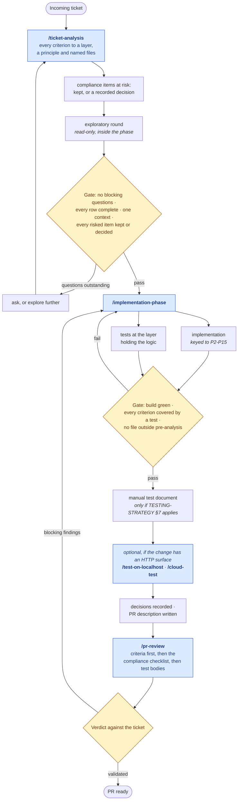

# Running a ticket

How the three delivery phases fit together, and how to use them. The phases themselves are
[`TICKET-ANALYSIS.md`](TICKET-ANALYSIS.md), [`IMPLEMENTATION-PHASE.md`](IMPLEMENTATION-PHASE.md)
and [`PR-REVIEW.md`](PR-REVIEW.md); this document is the map above them.

They exist because the procedure for delivering a ticket is the same every time. That is
what made it worth writing down, and what makes it worth installing rather than pasting:
a prompt rewritten per ticket is a prompt that drifts per ticket.

**Contents**

1. [The flow](#1-the-flow)
2. [What changed, and what it cost](#2-what-changed)
3. [Install](#3-install)
4. [Running a ticket](#4-running-a-ticket)
5. [Breaking the sequence](#5-breaking-the-sequence)
6. [Under a client without slash commands](#6-under-a-client-without-slash-commands)

---

## 1. The flow

Boxes naming a `/command` are skills you invoke. Diamonds are gates, and each one has
written exit criteria in the phase document that precedes it — that is the whole point of
them being drawn as gates rather than as good intentions.

Every phase opens by confirming the constitution and the guides are actually readable, and
stops if they are not. That is why `architecture-core` is not an optional companion
install: the phases are written in shorthand — "the kernel stays a kernel", "translate at
the edge" — and shorthand applied from memory produces output that sounds compliant
without being checkable. Each phase also requires every rule-shaped statement it emits to
cite the principle or guide section behind it, so an analysis, a decision or a review
finding can be traced back rather than taken on trust.



## 2. What changed

Against the manual flow this replaces, node by node:

| Was | Now |
|---|---|
| Ticket analysis, by hand | `/ticket-analysis` — and its output is a table, not prose: one row per acceptance criterion, carrying the layer, the governing principle, the guide to load and the files. A criterion with no layer is not analysed yet |
| *(nothing — this was implicit)* | A walk of the compliance checklist for the layers touched, listing what the change puts at risk, so a deviation is decided here rather than discovered mid-diff |
| Exploratory agent round | A step *inside* that phase, explicitly read-only, run before the code is allowed to redefine the requirement |
| Generate questions → resolve gaps → back to analysis | The same loop, but a question is only blocking if it blocks a decision; the rest become documented assumptions that reach the pull request |
| **Master prompt generation** | **Gone** |
| **Run master prompt** | **Gone** |
| Implementation phase (a: code, b: tests) | `/implementation-phase` — both tracks, in one procedure, in order |
| Optional test artifacts | A step inside that phase, conditional on what the change actually touches |
| *(was: run it and click around)* | `/test-on-localhost` and `/cloud-test` — the same pass written down, with the base URL resolved from the solution or passed in, health and degraded integrations captured first, and findings that must cite a principle to count |
| Create PR draft | §6 of the same phase, so the description is written from the work rather than reconstructed after it |
| PR review agent | `/pr-review`, which cannot edit — `disallowed-tools` enforces it |
| "Results satisfactory?" ×2, "Enough information?" | Three gates with named exit criteria — the first of them four conditions, not a feeling |

**The two nodes that disappear are the point.** Generating a master prompt and then running
it are two steps and one feedback edge that exist *only because the prompt is a text
artifact that has to be produced somewhere and carried somewhere else*. Generation is the
cost of pasting. Once the phase is installed, the procedure is fixed and reviewed once, and
what varies per run is the change agreed in the session — not an argument you type.

That also removes a class of failure rather than just some typing. The old
"results unsatisfactory → back to ticket analysis" loop was partly a check on whether the
*prompt* came out right this time. A version-controlled procedure cannot come out wrong on
a Tuesday, so what remains is a real check on the implementation — the loop below it, which
was already in the flow.

**What deliberately did not change:** the three feedback loops that matter. A failing gate
still sends you back, and `/pr-review` still returns to `/implementation-phase` rather than
forward. Packaging a workflow is not an argument for trusting it more.

## 3. Install

`ticket-delivery` is independent of the other plugins, but the procedures cite the
constitution and the guides throughout, so install `architecture-core` alongside it — the
phases are much less useful against standards the agent cannot read.

```sh
claude plugin marketplace add konradcinkusz/architecture-standards
claude plugin install architecture-core@architecture-standards
claude plugin install ticket-delivery@architecture-standards
```

Or declare it in the target repo so it is not a step anyone has to remember
([`REPO-BASELINE.md`](../guides/REPO-BASELINE.md) §7):

```json
{
  "extraKnownMarketplaces": {
    "architecture-standards": {
      "source": { "source": "github", "repo": "konradcinkusz/architecture-standards" }
    }
  },
  "enabledPlugins": {
    "architecture-core@architecture-standards": true,
    "ticket-delivery@architecture-standards": true
  }
}
```

The other clients, and the attach-the-repo-versus-install-the-plugin trade-off, are in
[`MARKETPLACE.md`](../../MARKETPLACE.md).

## 4. Running a ticket

In order, in the target repo's session. **Only `/cloud-test` takes an argument** — every
other phase works from the session it is invoked in, which is where the ticket, the agreed
change and the diff already are.

Paste the ticket into the session — its own words, its acceptance criteria — then:

```
/ticket-analysis
```

It reads the ticket from the conversation; it cannot fetch one, and a bare identifier with
no text behind it is refused rather than analysed. Reads it against the architecture, maps every acceptance criterion to a layer and
at least one file, runs the read-only exploratory round, and ends by testing the gate. Its
output is an analysis, a list of open questions split into blocking and non-blocking, and a
verdict on whether implementation can start.

**Do not proceed past a failing gate.** Answer the blocking questions or explore further,
then re-run. A ticket that enters implementation with an unresolved ambiguity does not fail
loudly — it produces a plausible diff that solves the wrong problem.

```
/implementation-phase
```

No argument: it implements the change this session already agreed, and stops if the session
agreed none. The procedure: pre-analysis that proves the build green and names every file and existing
test *before* an edit; the change itself, keyed to the principles a diff can violate; tests
at the layer holding the logic, including the regression half; the manual test document
only where automation genuinely cannot substitute for a human; recorded decisions; and the
pull-request description.

Between implementation and review, optionally — only when the change has an HTTP surface
worth seeing over the wire:

```
/test-on-localhost
```

Exercises the change against the API **already running on your machine**. It resolves the
base URL from the solution itself — the Aspire AppHost (P1), the service's
`launchSettings` profile, or the running dashboard — rather than from a remembered port.
It checks `/health` and `/alive` first and records which optional integrations are degraded
(P8), because that is the difference between a broken endpoint and one correctly degrading.
It never starts the application and never edits code.

```
/cloud-test https://my-service.fly.dev
```

The same pass against a deployed environment. **The base URL is a parameter**, echoed back
before the first request and never derived from a naming convention — a guessed host either
wastes the pass or hits the wrong environment. Read-only by default; writes need
authorising in that run, irreversible operations need confirming one at a time, and
production stays read-only regardless. It confirms the deployed build actually carries your
change before trusting any result (P12), and treats a slow first request as scale-to-zero
(P7) rather than a latency finding.

Both keep credentials in the environment and out of every document, and neither writes a
results file unless somebody will read it.

```
/pr-review
```

Reviews the current branch; pass `/pr-review <branch>` for another one. Starts from the
acceptance criteria rather than the diff, requires both satisfying code and a proving test
for each, walks the compliance checklist for the layers touched, reads test bodies instead
of counting them, and ends with an explicit verdict. It reports; it does not edit.

A blocking finding sends you back to `/implementation-phase`, not forward to merge.

## 5. Breaking the sequence

The phases are separable, and pretending otherwise makes them ceremony:

- **A one-line fix with an obvious cause** does not need `/ticket-analysis`. It still needs
  the implementation phase's §7 stop conditions, which is the part that catches the
  one-line fix that turns out to change a public contract.
- **A hotfix** runs the implementation phase with the analysis compressed to naming the
  owning context and the blast radius. Record what you skipped in the pull request rather
  than implying it was done.
- **`/pr-review` stands alone.** It is useful on any pull request with acceptance criteria,
  including ones no agent implemented — reviewing someone else's work against the
  compliance checklist is its own job.
- **The two verification passes are optional and independent.** A change with no HTTP
  surface needs neither. `/cloud-test` is also useful with no ticket at all — pointed at an
  environment to establish what is deployed and what is degraded there.

What does not bend: the gates. Compressing a phase is a decision you record; passing a gate
you did not meet is the failure the gates exist to catch.

## 6. Under a client without slash commands

`/ticket-analysis` and the rest are Claude Code's spelling. The same five skills install
under Copilot CLI and VS Code from the same tree, where they are selected by their
descriptions rather than typed — so "implement what we just agreed" reaches the
implementation phase by routing instead of by invocation. That works because none of them
depend on being handed an argument in the first place.

Two things do not travel, and it is better to know which:

- **The argument hint**, which now matters for one command only: name the environment's URL
  in the sentence when you mean `/cloud-test`.
- **`disallowed-tools` on `/pr-review`.** Under a client that ignores it, "the review does
  not edit" is back to being a rule in the document rather than a property of the session.
